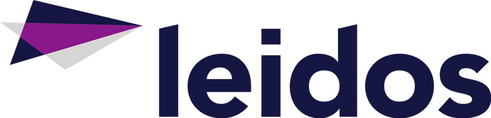

  

**Jack Doggett** 
---
Junior Computer Science and Math student at the Univeristy of Maryland
 
 
 
 

I am a CS Major specializing in machine learning, Math Major, Neuroscience Minor, and Computational Finance Minor. Yes, I know that is a lot.... 
I am interested in Systems programming, Machine Learning, Financing modeling, and computational research in Neuroscience. 

Most of my code on my <a href="https://github.com/John-Doggett">github</a> is numerical stuff, with some scripts. 

  

I am excited to annouce that I will be studying abroad at University College London in Spring 2024. I will be studying as a mathematics affiliate student.
I will be taking Computational Methods, Algebra 4 (abstract algebra), and Visual Neuroscience.
Of course, I'll be exploring London and the UK and enjoying the culture.

  

In Summer 2023 I was a software development intern for Leidos working on the FAA's ERAM. I was on the processor services team. 
I have accepted an offer to return to Leidos as an intern in Summer 2024 to be on a team responsible for the infrastructure (servers) for ERAM. 
This team will have an important part in the technology upgrades the FAA is planning to complete.

In my sophomore years I was an undergraduate technician at the University of Maryland Institute for Advanced Computer Students. 
I want to thank everyone there who helped me along the way that year. I learned so much in Linux and SysOps, it's really has changed my view on computing. 

Connect with me on my <a href="https://www.linkedin.com/in/jack-c-doggett/">LinkedIn</a>.
